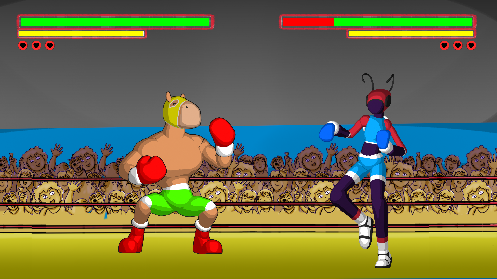

# Poka Lucha

Game made for Global Game Jam 2026, at the Curitiba site.



This version is what what presented by the end of the Jam. Next steps are to make this playable in the browser. 


## Running the game

If you have access to a Python 3.11+ environment, the game can be run like this:

```
# navigate to project directory
$ cd pocalucha

# create venv and activate it
$ python -m venv venv
$ source venv/bin/activate

# install dependencies
$ pip install -r .'/requirements.txt

# run game
$ python -m pygametest
```

## Credits

This game was made by:

 + André Luander Aparecido Pilato (2D Art)
 + Arthur Polak Furman (Construct Programming)
 + Bruno Wilczek (Construct Programming)
 + Douglas Luiz Castelani de Lima (2D Art)
 + Lucas Pires Camargo (Python Programming)
 + Luís Augusto Cavalheiro (Additional Python Programming)
 + Pedro Paulo Vilaça Costa (3D Art and renders)
 + Tiago Pires Camargo (Music Production)
